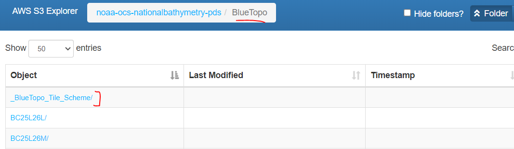

# Using-Boto-to-retrieve-data-from-Public-AWS-Bucket
This Python script (TopoBoto.py) retrieves an AOI geopackage from the Public National Bathymetry Source AWS Bucket.

The National Bathymetric Source (NBS) project creates and maintains high-resolution bathymetry composed of the best available data. This project enables the creation of next-generation nautical charts while also providing support for modeling, industry, science, regulation, and public curiosity.

## Goal of this script
NBS is not yet fully built out. The purpose of this script is to scrape the NBS 'noaa-ocs-nationalbathymetry-pds' bucket, and retrieve the latest Area Of Interest Geopackage. This geopackage has all the NBS Tile AOIs where the NBS is currently available. This is useful for Electronic Nautical Chart production, as it will show if the NBS is available for a partiucular area, hence available for ENC production/application in that area.  

## Major Actions of the Script
- Generate your credentials to access bucket (Must be done, even though the bucket is public).
- Create session using boto3.

- Define desired bucket (noaa-ocs-nationalbathymetry-pds) and desried prefix ('BlueTopo/_BlueTopo_Tile_Scheme/BlueTopo_Tile_Scheme').
  
  
  
   

-  Employee pageinator to iterate through the bucket objects, until it finds the AOI geopackage.
  

- Outputs the geopacakge to a scratch folder and Converts the geopackage to a shapfile.

  

## Image of Geopackage AOI in ArcGIS Pro

## Image of Shapefile AOI in ArcGIS Pro

